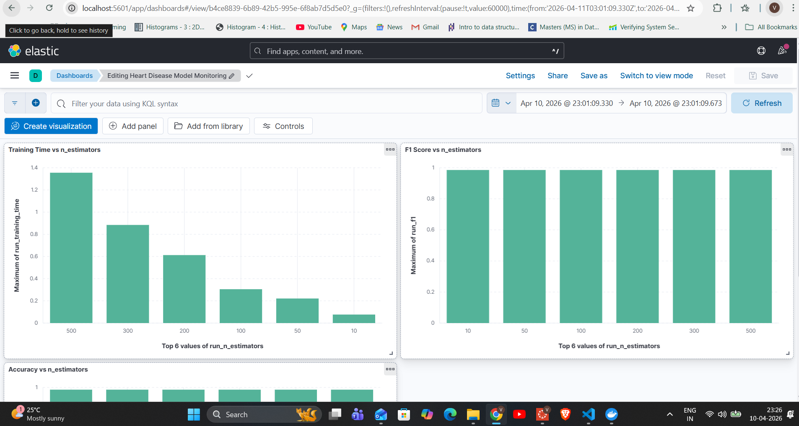

# ELK Stack - Heart Disease Model Monitoring

This lab demonstrates an end-to-end MLOps observability pipeline using the ELK Stack (Elasticsearch, Logstash, Kibana) to monitor a Random Forest classifier trained on the Heart Disease dataset.

## Modifications from Original Lab

| Original | Modified |
|----------|----------|
| Iris dataset (toy) | Heart Disease - Cleveland UCI (real-world medical) |
| Logistic Regression | Random Forest Classifier |
| Single training run | Hyperparameter sweep over `n_estimators = [10, 50, 100, 200, 300, 500]` |
| 3 metrics logged | 12 metrics logged per run |
| Manual WSL Ubuntu setup | Docker Compose (Elasticsearch + Kibana + Logstash) |

## Dataset

**Heart Disease - Cleveland UCI** (`heart.csv`)
- 1,025 samples, 13 features (age, cholesterol, resting BP, chest pain type, etc.)
- Binary classification: `1 = heart disease present`, `0 = not present`
- Source: [Kaggle - Heart Disease Dataset](https://www.kaggle.com/datasets/johnsmith88/heart-disease-dataset)

## Model

**Random Forest Classifier** (`sklearn.ensemble.RandomForestClassifier`)

Hyperparameter sweep over `n_estimators` to observe the tradeoff between model complexity and training time:

| n_estimators | Training Time |
|---|---|
| 10  | ~0.07s |
| 50  | ~0.12s |
| 100 | ~0.18s |
| 200 | ~0.41s |
| 300 | ~0.87s |
| 500 | ~1.29s |

**Key insight**: Accuracy converges at 98.5% from as few as 10 trees, while training time increases 18x — demonstrating diminishing returns on n_estimators.

## Metrics Logged Per Run

- `accuracy`, `f1_score`, `precision`, `recall`
- `true_positive`, `true_negative`, `false_positive`, `false_negative`
- `false_positive_rate`, `false_negative_rate`
- `training_time`, `n_estimators`

Each run emits a `RUN_SUMMARY` log line containing all metrics — this creates one complete Elasticsearch document per run for Kibana visualizations.

## Running the Pipeline

### Prerequisites
- Python 3.12+
- Docker Desktop

### 1. Install dependencies
```bash
pip install pandas scikit-learn
```

### 2. Train the model and generate logs
```bash
python train_model.py
```

### 3. Start the ELK stack
```bash
docker compose up -d
```

### 4. Verify data in Elasticsearch
```bash
curl http://localhost:9200/heart-disease-training/_count
```

### 5. Open Kibana
```
http://localhost:5601
```

Create a data view with index pattern `heart-disease-training` and timestamp `@timestamp`.

## Kibana Dashboard

Dashboard: **Heart Disease Model Monitoring**



Charts:
- **Training Time vs n_estimators** — shows how training cost scales with forest size
- **F1 Score vs n_estimators** — shows accuracy plateaus early
- **Accuracy vs n_estimators** — confirms diminishing returns
- **False Negative Rate vs n_estimators** — critical for medical context (missed diagnoses)

## Shutting Down
```bash
docker compose down
```
